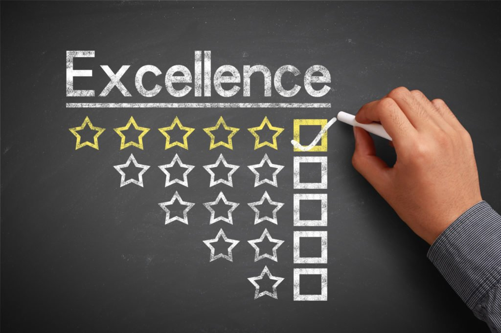

When working and learning in any field, it is common to pick up on many different skills and techniques over the course of one’s time spent in that career or area. Sometimes, these skills are very closely related to the area that introduced them, and thus they cannot be applied to other careers or projects, only a select few similar ones. However, this is only a very narrow range of the skills that are made available to students and new-hires, and many of the skills that are learned during courses and trainings are applicable in a vast amount of situations and will likely be useful no matter what path one takes in life. The software engineering and design fields are no different in this regard, and many of the skills that we build up over the course of our careers prepare us to be resourceful and ready for whatever life throws at us.

## Keeping Up With the Standards

One such practice that we learned to follow was the idea of coding standards, which provide a base set of rules/requirements that our code (work) must meet before being shared with the rest of the team. These standards make it so that any new or existing member of a team is able to easily read and understand the functionality of the code, how the code is able to run, and what the code adds to the project. The principles and ideas behind these standards stem from the more basic idea of working in a team, as it is important to submit quality work so that the team overall produces to the best of their ability. Coding standards then, can be applied to every other possible job out there, as it is just good practice to ensure that your work is excellent. They can be applied to solo careers as well, since you never know when you might need to look back at a previous work that you have done and if it was up to the standards, then it would be very easy to pick back up from and work with.

## Dealing With Our Issues

Another technique that we were taught was agile project management, being able to handle and manage the planning and executing of the necessary steps to finishing the end goal of a project. Specifically, we were taught how to split up certain deadlines and requirements into their own smaller and separate tasks/issues so that we could simply work through these issues one by one. This style of management, called “Issue Driven Project Management”, can be applied to any of life’s tasks, no matter if the task is large or small in size. For every goal that exists, there must also be a number of steps that one can take to realize said goal, and these steps can be referred to as their own individual issues that must be addressed before the end goal is met. By breaking down a project into smaller tasks to be completed at their own pace, the overall project itself can seem less daunting, making it easier to slowly work through and lessen the amount of pressure and stress that one might go through when attempting to meet deadlines.
