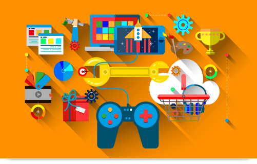

Coding standards are certain rules and habits that programmers are generally expected to follow when creating/writing code and working on projects with collaborators or partners. By implementing coding standards in a team based environment, all code should be formatted in a way that it is easier to read and understand for any existing member or future team members who join later on and will likely not have any prior knowledge of the project. This ensures that everyone is on the same page with one another, which can then result in easier collaboration and any questions are able to be answered by more than just a single person.

## Learning with and without Coding Standards

When learning a new programming language, it is important that the examples given to you are easily digestible and understandable

## Seeing Both Sides of the Same Coin

In the future, I would like to be able to comfortably handle both the front and back-end sides of any project that I happen to come across or start one day. If I were to develop the skills to do this, it would widen the number of possibilities and opportunities that I would be able to take advantage of and I would be able to bring a lot more to the table. Plus, I have always enjoyed seeing the interactions between things all around me, and trying to figure out how they work, and if any problems were to come up, I would always try and come up with ideas of my own on how to fix them or why they happened. I am currently working in a team that handles the UI and API side of a web application for UH, but am not yet fully confident in my ability to smoothly tackle problems and integrate solutions or new features.

## Bridging the Gap Between Software and Hardware

Every once in a while, I would have random ideas pop into my head on possible products that could be sold with the goal of solving a problem or making a person’s day-to-day life easier or more efficient. There would also be times when I notice a small problem in my life or someone complaining about a small inconvenience that got me thinking about how I would go about solving these problems with a tool or gadget. I would also spend time focusing on some of the larger problems in the world as well, but there are millions if not billions of ideas out there already, and the actual problem lies in how to execute such a plan on such a wide scale. I’m always thinking about problems and solutions, but since I have never really worked with connecting software to hardware, other than say, middle school robotics, I never knew how to act on these ideas or bring them to life. It is an interest of mine, but one that I have put in the back of my mind for the longest time, and it will likely stay there until I get more of an idea on how to start, or become successful enough to risk trying without worrying about the losses.
