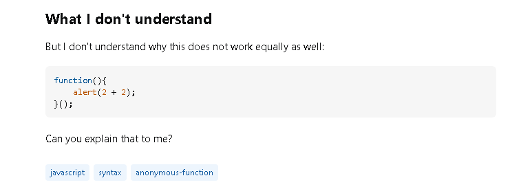
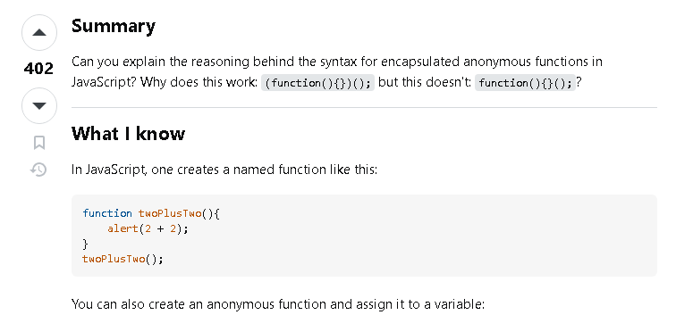

Stack Overflow is an online community driven discussion board where many programmers and developers come together to answer questions anyone might have on concepts or ideas in terms of coding or other fields of technology.
Since it is a community-run website, there are people from all over the world with all sorts of different fields of knowledge and experiences, and not many questions go unsolved for long. There is also the opportunity for multiple solutions or answers to be given to a single question, providing different perspectives and approaches for certain topics.

## Strategy: Posing Smart Questions

One of the best ways to ensure a question is answered as quickly and effectively on Stack Overflow is to ask good and smart questions, which has many advantages over posing a simple question on your topic that took you five seconds to come up with, or the first question that you wanted answered as quickly as possible.
A smart question should, obviously, be well thought out and prepared well, which shows your level of understanding on the topic at hand as well as what specifically you want the answer to, or where your level of knowledge falls short. However, this does not mean that a poster should spend hours compiling their entire thoughts on the matter, as there should be a short explanation of the problem, not an entire life story leading up to the present.
There should be as much background information given as needed for readers to fully comprehend the context behind the question being asked and it should be clear what the goal or end goal the answer should provide.

## The Search

Going through and searching Stack Overflow for questions is something that many developers are familiar with, as whenever they encounter a problem, one of the first logical steps would be to see if anyone else had also encountered the same problem, and if said problem already has a solution out there somewhere on the internet.
Using their search filter options, it is easy to find good examples of good questions, which is exactly what I did to find this question posted around 14 years ago, with 10 answers as of right now, 2024, all of which have been upvoted or approved by any other readers or respondents that also came across the question. The original poster asked about the capabilities JavaScript in terms of encapsulating functions in different wrappers like parenthesis or curly brackets, and provides different examples of what they found to work and already understands.

## Question Analysis

<div">
  
  

This question is a brilliant example of a smart question, firstly because the poster made it very clear as to what they wanted answered, providing as much background information as they could, in the form of code that they understands already. And while they did write a lot in their description, there was just the right amount of information, enough to be precise and straight to the point but not too much to deter possible answerers.
The asker formatted and planned their question and summary perfectly, leaving room for many different answers and ideas to be formed on the topic while being professional and not formal or pleading.
Questions such as these are important for software engineers to be able to produce on their own, since through asking smart questions, it is easy to get answers and insight on any problems they might run into, no matter the field or language, there is a high chance that someone will be have some ideas.
