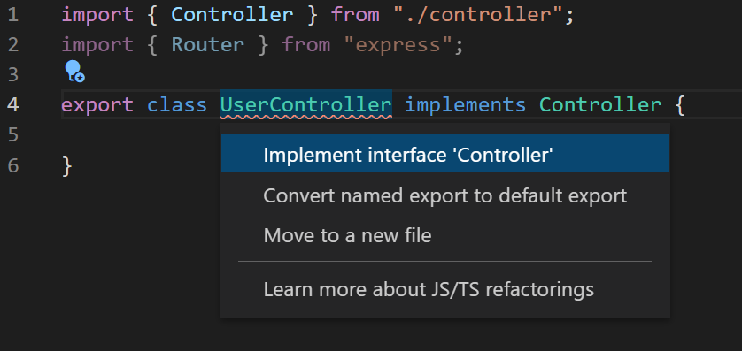

In life, there are many times when we are encouraged to follow certain guidelines or told that there are certain ways to do things the “right” way, and we simply accept and follow them, since they are much better than anything we can come up with ourselves, and have become widely accepted as efficient or effective. Many things in life follow this example, the most basic of which are instructions, and are followed closely by the training that new employees or recruits receive when they are learning the ins and outs of their newfound careers. These trainings prepare them mostly for what they can expect to deal with on the job, as well as provide basic information on the job details and how to perform certain tasks with the utmost efficiency.

In the coding and programming industry, things are no different, with many different workplaces offering their own versions of onboarding and recommendations on how to format code or tackle certain problems. When programming, it is common to group similar elements or aspects of a system together and write code such that it is easy to understand what each thing will do, or use templates or base components to create many of a certain element, each with their own values, similar to React components. Another common practice is to implement certain classes or functions to be used later in a project, and to simply import these classes in other parts of the project where their functionality will be used.
