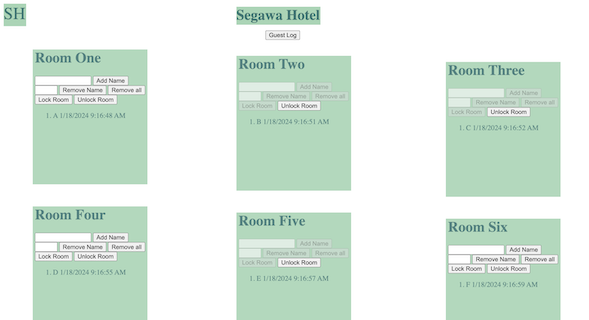

  

Back when I was in high school beginning to learn about HTML, CSS, and JS, and how they can be used together, our teacher assigned us a project to create a sample page that a hotel might use. The page includes six rooms with individual guest lists of who is currently residing in each room, the ability to add and remove guests, lock and unlock the room to prevent new guests from checking in, and an overall guest log of all guests who have checked into the hotel, even if they have left already.

Source: <a href="https://github.com/isaseg/Restaurant-stuff">isaseg/restaurant</a>
