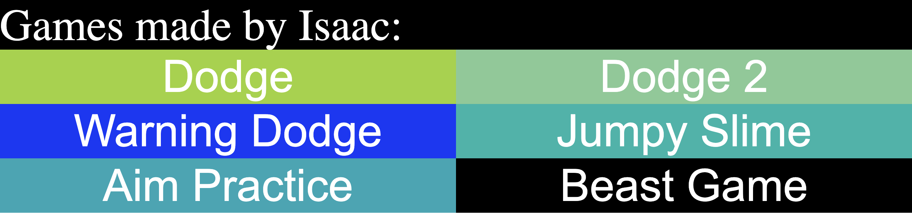
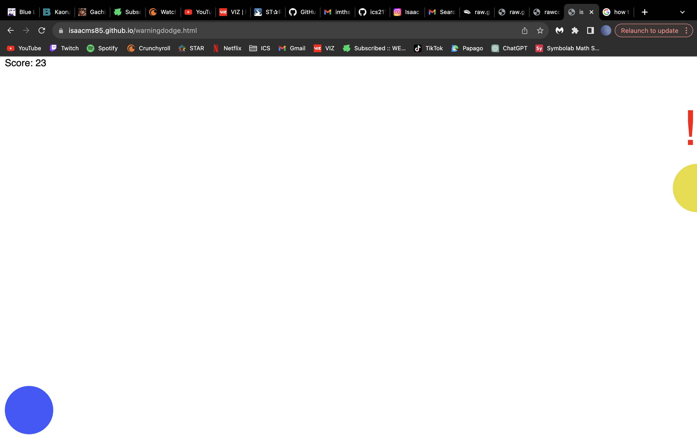
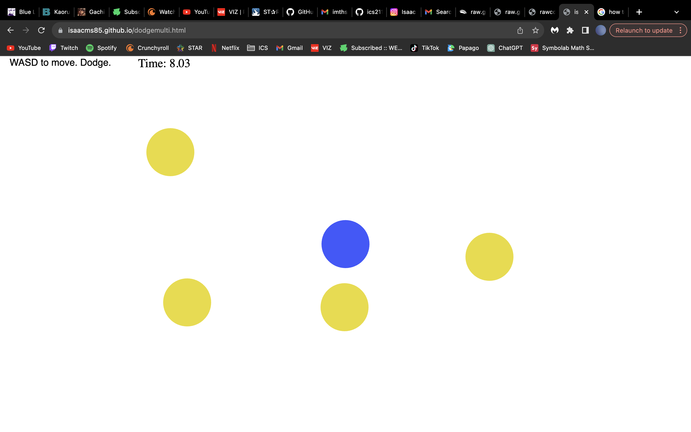

During high school, we were introduced to a JavaScript library called p5, which can be used to design and add interactive visuals to a page. I used this library to create some small games in my free time, mainly consisting of balls handling collision with one another, with the player having to dodge the oncoming balls. There is also a game where I tried to include some visuals from an old favorite game of mine, along with the addition of the music that could be found in that game (credited). Ignore the last one which I included as an old joke that was used to be popular.

Source: <a href="https://isaacms85.github.io">isaacms85.github.io</a>
