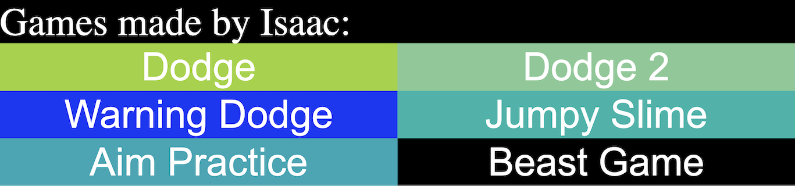
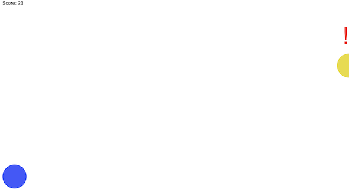
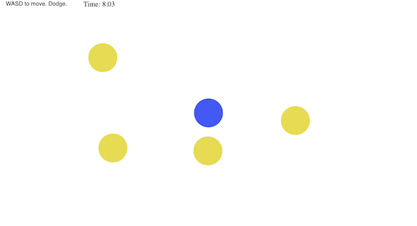

During high school, we were introduced to a JavaScript library called p5, which can be used to design and add interactive visuals to a page. I used this library to create some small games in my free time, mainly consisting of balls handling collision with one another, with the player having to dodge the oncoming balls. There is also a game where I tried to include some visuals from an old favorite game of mine, along with the addition of the music that could be found in that game (credited). Ignore the last one which I included as an old joke that was used to be popular.

Since these were a personal side project(s), I was the only one to constribute anything to this page, and was in charge of overseeing the elements of this page and the games they included. Every game idea was thought of by myself, as well as how I would go about implementing some of the parts that the game might need implemented or introduced. Each and every game had their own process that I had to figure out as I went, and I would simply work on this project whenever I had the time or motivation to.

From this project I learned about some of the smaller intricacies that are included in game development and how the different game elements interact with one another smoothly to make up the game processes. I learned how to make use of a JavaScript library and implement some of their functions into my code in order to make dynamic page elements interact with each other in the ways I wanted them to. I taught myself how to handle collision for my games, which I based most of the games off of, where a player would have to dodge incoming obstacles or "enemies". I also taught myself how to create indicators of off-screen obstacles that would be coming into play soon, which I used to make the "Warning Dodge" game. The JS code that I used to implement the incoming "meteors" can be found below:

```cpp
      function meteor() {
        this.x = w + 2000;
        this.y = Math.floor(Math.random()*h*9/10);
        this.show = function() {
          noStroke();
          fill(234, 218, 42);
          ellipse(this.x, this.y, 100,100);
        };
        this.kill = function() {
          this.x -= speed2;
          d = dist(this.x,0,player.x,0);
          dtwo = dist(0,this.y,0,player.y);
          if ((d < 30) && (dtwo < 80)) {
            noLoop();
            window.alert('You lose.');
            location.reload();
          }
          else if (this.x < 0) {
            this.x = w + 2000;
            this.y = Math.floor(Math.random()*h*9/10);
            s++;
          }
          else if (this.x > w) {
            noStroke();
            textSize(100);
            fill(255,0,0);
            text('!' , w-30, this.y+50);
          }
        };
      }
```

Source: <a href="https://isaacms85.github.io">isaacms85.github.io</a>
