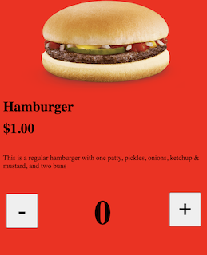
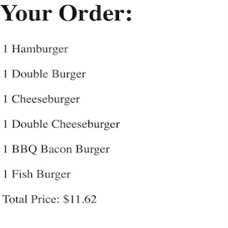

Back in high school, we were tasked to create a site that a restaurant or fast food chain might use for online orders. The site could handle the addition of any menu item and dynamically displayed the user's entire order at the bottom of the page, along with the expected price with tax calculated. A JSON file was used to pass to the page the menu items along with their descriptions and price. Upon clicking "Checkout", the user would be redirected to a new page consisting of their entire order, similar to what they would have seen at the bottom of the home page.

I was the only contributor to this restaurant project, as it was up to each of us to build up their own restaurant page based on what we were learning about in class, and applying those concepts to a real life example. I was responsible for figuring out how to program each function and operation that a restaurant's online order page might include, such as handling multiple different menu items being added to and removed from an overall order, collecting all the different values of each item and displaying the entire order with the names of each item along with the number of items added to the order, calculating the total cost of the order, including tax, and redirecting to a checkout page with a confirmatory viewing of the order.

While working on this project, I learned how to work with JSON in order to handle the different menu item objects and pull the data from the restaurant.json file and use it on these pages. I also learned how to connect script functions from JavaScript to an HTML page's elements, use CSS to stylize certain HTML elements of a web page, and change an HTML element’s value dynamically, based on a user’s actions or input. Another thing I learned during this project was the use of session storage in JS to pass data between pages and retain their values for a single session. The functions for adding and removing the first menu item to/from an order can be found below:

```cpp
      function minus1() {
        if (amount1 > 0) {
          amount1--;
          document.getElementById('amnt1').innerHTML = amount1;
          var foodAndAmount1 = document.getElementById('itemone').innerHTML = amount1 + name1;
          }
          document.getElementById('totalPrice').innerHTML = "Total price: $"+ (tax*((amount1 * price1) + (amount2 * price2) + (amount3 * price3) + (amount4 * price4) + (amount5 * price5) + (amount6 * price6))).toFixed(2);
          sessionStorage.setItem('item1', foodAndAmount1);
          sessionStorage.setItem('totalPrice', (tax*((amount1 * price1) + (amount2 * price2) + (amount3 * price3) + (amount4 * price4) + (amount5 * price5) + (amount6 * price6))).toFixed(2));
          document.getElementById('checkout').style.opacity = 1;
      }
        function add1() {
          amount1++;
          document.getElementById('amnt1').innerHTML = amount1;
          if (amount1 => 1 ) {
          var foodAndAmount1 = document.getElementById('itemone').innerHTML = amount1 + " Hamburger";
          }
          document.getElementById('totalPrice').innerHTML = "Total price: $"+ (tax*((amount1 * price1) + (amount2 * price2) + (amount3 * price3) + (amount4 * price4) + (amount5 * price5) + (amount6 * price6))).toFixed(2);
          sessionStorage.setItem('item1', foodAndAmount1);
          sessionStorage.setItem('totalPrice', (tax*((amount1 * price1) + (amount2 * price2) + (amount3 * price3) + (amount4 * price4) + (amount5 * price5) + (amount6 * price6))).toFixed(2));
          document.getElementById('checkout').style.opacity = 1;
          }
```

Source: <a href="https://github.com/isaseg/Restaurant-stuff"><i class="large github icon "></i>isaseg/Restaurant</a>
