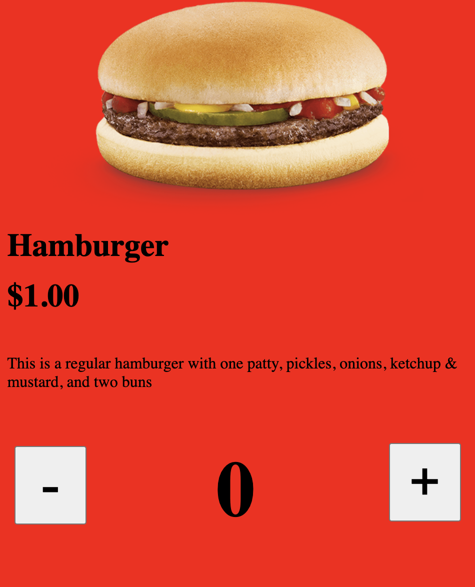
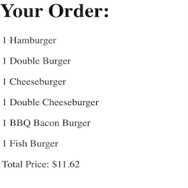

Back in high school, we were tasked to create a site that a restaurant or fast food chain might use for online orders. The site could handle the addition of any menu item and dynamically displayed the user's entire order at the bottom of the page, along with the expected price with tax calculated. A JSON file was used to pass to the page the menu items along with their descriptions and price. Upon clicking "Checkout", the user would be redirected to a new page consisting of their entire order, similar to what they would have seen at the bottom of the home page.

Source: <a href="https://github.com/isaseg/Restaurant-stuff"><i class="large github icon "></i>isaseg/Restaurant</a>
