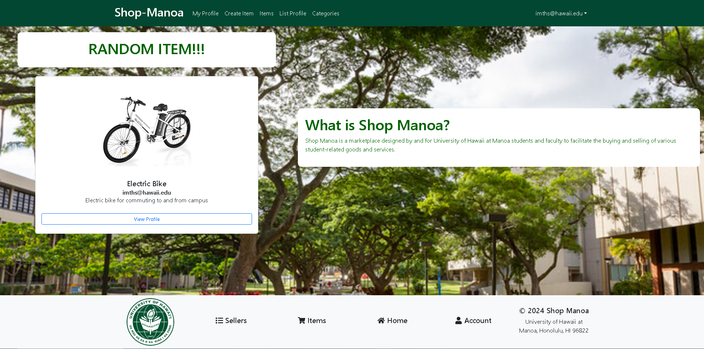
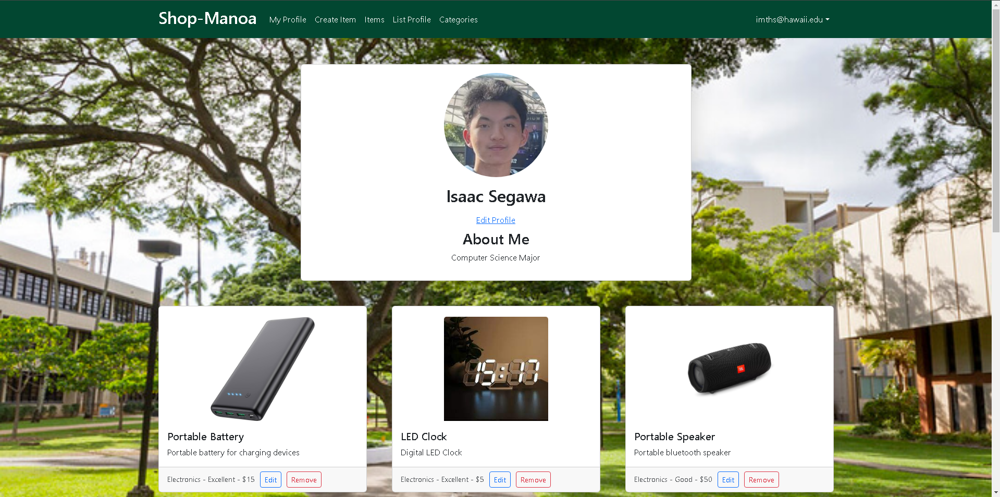

  
  

During our time in the course ICS 314, Software Engineering I, we learned about JavaScript, CSS, React, Meteor, and MongoDB, learning how we could use these languages, along with some useful libraries, to add functionality and styling to any project that we work on in the future. Once we had learned most of the essentials and basics of each, we were assigned a project to create a web application based on the type of project prompt we were given. Shop-Manoa is a site for University of Hawaii at Manoa students and staff to be able to list items that they no longer need and want to sell so that other students and staff members can see and contact them for. More information can be found at <a href="https://shop-manoa.github.io/">shop-manoa.github.io</a>.

I was one of six contributors to this project, and we all worked together to implement the many functions of the web app such as listing an item, creating a profile, removing/editing an item, etc. I was responsible for creating some of the basic page designs and components that we would later use and add the functionality to, adding a color scheme to the entire site, implementing the ability to take down a user's listing (from both the owner and admin's side), implementing the ability to edit an owned item, and some more cleanup of the site of pages that we did not end up keeping.

From this project I learned more on how to work with a team to create a web application that serves a population of users, on top of my work experiences. Part of this project that was different from my workplace was how much the team and I communicated with each other, since at work we all tend to take on our own tasks and work on them individually, reaching out when we would need help or ask for opinions, since our project is already quite large enough that we are all working on separate aspects of the application. For this project however, we were starting from the beginning, building up the project piece by piece, which required a lot more teamwork and communication to ensure that everything would fit and run together.

Source code: <a href="https://github.com/shop-manoa/shop-manoa">shop-manoa/shop-manoa</a>

Website: <a href="https://shop-manoa.com/">Shop-Manoa</a>
